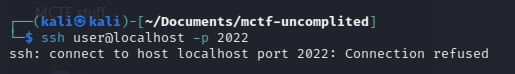
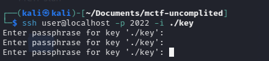
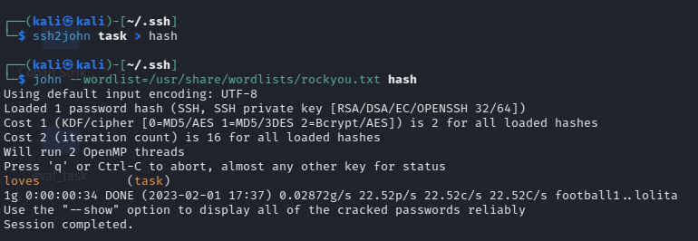
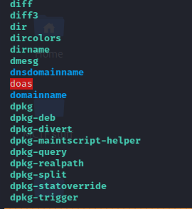
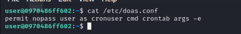
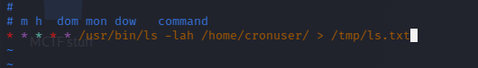
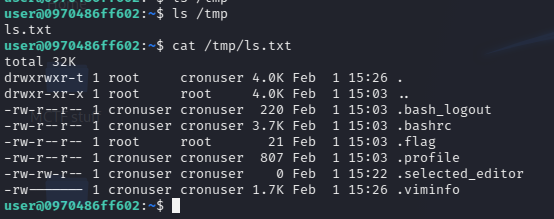
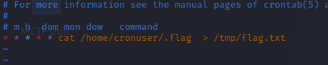
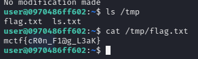

# mctf-uncompleted 
## Деплой
Участникам выдать файл [key](./key). Описание таска в соответсвии с пунктом ниже, в качестве *ip* напишите домен. При смене порта также смените его в docker-compose.yml

## Описание 
Безалаберный сотрдник Иван (он кстати уже уволен) не удосужился доделать свой таск и нам пришлось выпустить его как есть. Мы также изъяли его ключ доступа, но кажется с ним что-то не так.
```
ssh user@<ip> -p 2022
```
## Writeup
Без ключа подключение не пройдёт, его необходимо указать.


При попытке указать ключ, сервер запрашивает у нас фразу доступа


Её можно подбирать руками, но гораздо оптимальнее воспользоваться утилитиой JohnTheReaper и его модулем для расфировки ssh ключей.


Получаем следующую пассфразу
```
loves
```
С ней мы и заходим на машинку.
Посмотри доступные бинарники командой  **ls /usr/bin/**


Среди прочего у нас есть исполняемый SUID-файл  [doas](https://wiki.archlinux.org/title/Doas_(Русский)), который является аналагом sudo. Его конфигурацию можно прочитать по пути **/etc/doas.conf**. Сделаем это


Он позволяет запустить **crontab -e** от пользователя **cronuser** без пароля.
Для того чтобы сделать это вводим: 
```
doas -u cronuser crontab -e 
```
Откроется стандартный шаблон кронтаба, сделаем задачу с листингом домашней директории **cronuser** с выводом в директорию **/tmp**, которая в отличии от первой доступна всем. Синтаксис кронтаба можно поискать в интернете. 


Смотрим директорию **/tmp** и видим вывод команды. Там в том числе указан скрытый файл **.flag**


Проворачиваем то же самое с командой **cat /home/cronuser/.flag** и получаем флаг


## Flag
```
mctf{cR0n_F1@g_L3aK}
```
## TODO
- ~~ssh~~
- ~~Doas and Cron~~
- ~~Flag permissions~~
- ~~Garbage cleaner~~
- ~~SSH passphrase~~
- ~~Tests~~
- ~~Writeup~~
